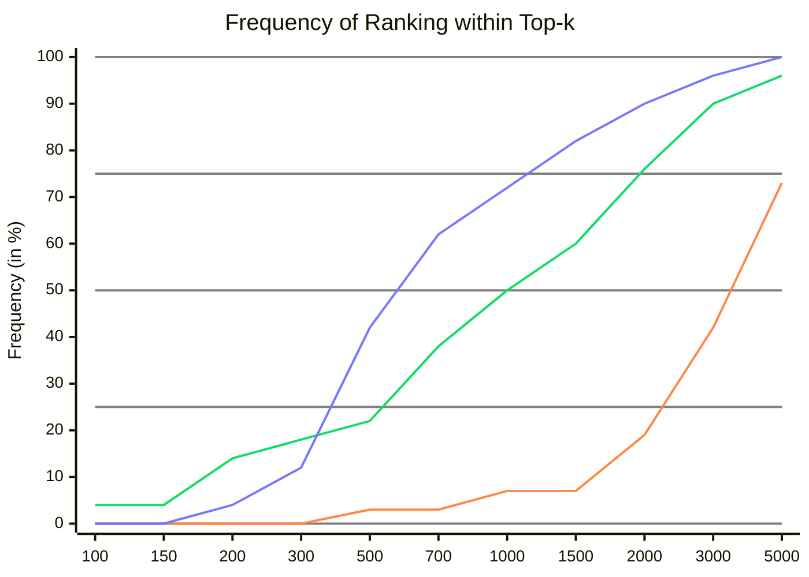
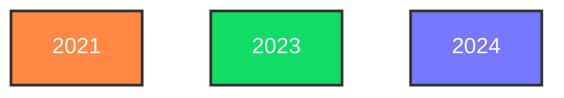
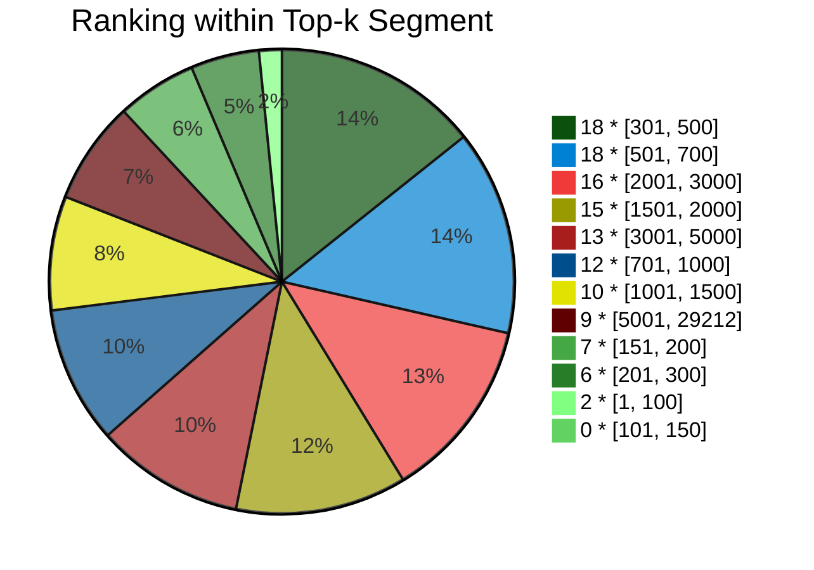

This is the home of my personal times, ranks and scores on [Advent of Code](https://adventofcode.com/).

Note that only those dates are included on which I participated in a *"competitive"* manner (i.e., being available at 6am CET and having a decent IDE).

In case you wonder, I used Rust in 2021/2023 (solutions [here](https://github.com/M1ngXU/aoc-rs)). The first half of 2021 also in JavaScript.

# Series Table
Rank by Quantile
```
Year | Best |  5% |  10% |  20% |  30% | Median |  75% |   90% | Worst
======================================================================
2021 |  398 | 909 | 1566 | 2211 | 2262 |   3128 | 5374 | 16846 | 29212
2023 |   44 | 167 |  184 |  370 |  590 |    979 | 1989 |  2989 |  5649
2024 |  155 | 201 |  246 |  323 |  401 |    557 | 1023 |  1973 |  4844
```
Frequency by Rank
```
Year | 100 | 150 | 200 | 300 | 500 | 700 | 1000 | 1500 | 2000 | 3000 | 5000
===========================================================================
2021 |  0% |  0% |  0% |  0% |  3% |  3% |   7% |   7% |  19% |  42% |  73%
2023 |  4% |  4% | 14% | 18% | 22% | 38% |  50% |  60% |  76% |  90% |  96%
2024 |  0% |  0% |  4% | 12% | 42% | 62% |  72% |  82% |  90% |  96% | 100%
```

# Series Chart





# Overall

